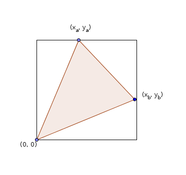
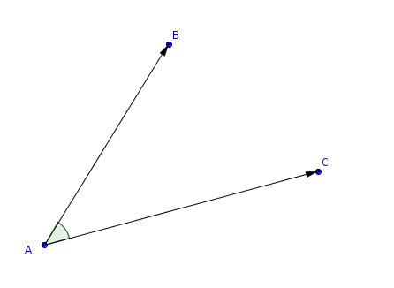
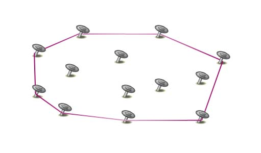

# Geometria obliczeniowa dla bystrzaków, czyli jak nie załamać się podczas robienia zadania ,,Robocik''.

Geometria obliczeniowa jest traktowana jako zło konieczne przez większość zawodników olimpiady. Ja uważam, że to jedne z
tych punktów, które najłatwiej zdobyć, ponieważ zadania z geometrii na II i I etapie nie obejmują zbyt wiele teorii.
Jedyną trudnością w nich jest implementacja, która początkującym programistom może przysporzyć dużo frustracji.
Postaram się przekazać kilka metod, które sprawią, że pisanie i debugowanie geometrii obliczeniowej będzie przyjemniejsze,
kod będzie bardziej kompaktowy i przejrzystszy.
Poniżej ogólny zarys tego, co się będzie działo na wykładzie, fragmenty kodów i (na koniec) zadanka do poćwiczenia.

Spis treści:

  * Reprezentacja obiektów geometrycznych w pamięci
  * Iloczyn wektorowy
  * Sortowanie kątowe
  * Otoczka wypukła

## Reprezentacja obiektów geometrycznych w zadaniach algorytmicznych i kilka uwag dot. precyzji.

Podstawowym obiektem, na którym operuje się w zadaniach, jest punkt. Reprezentowany jest przez parę współrzędnych **x, y**, najczęściej
liczb całkowitych. W geometrii obliczeniowej, jak sugeruje nazwa, będziemy wykonywać dużo działań na takich punktach, między innymi dzielenie
i mnożenie. Tak jak mnożenie najczęściej nie sprawia problemów --- zazwyczaj wystarczy reprezentacja przy użyciu typu **long long**,
tak dzielenie może pociągnąć ze sobą utratę precyzji. Dla przykładu, nawet jeśli dwa punkty mają obie współrzędne całkowite, tak
środek odcinka, który tworzą wcale nie musi mieć tak ,,wygodnych'' współrzędnych. Z tego powodu tam gdzie się da, będziemy używali typów
całkowitych --- **long long** i **int**, a w ostateczności skorzystamy z najbardziej precyzyjnych zmiennoprzecinkowych **long double**.

Pozostałe obiekty geometryczne, takie jak wektory, proste, odcinki i wielokąty będą reprezentowane z pomocą jednego bądź więcej punktów.
Co więcej, o punkcie możemy myśleć jak o wektorze zaczepionym z początkiem w punkcie **(0, 0)**. To ułatwi nam myślenie o geometrii i samą implementację.

### Jak przechowywać w C++ punkty?

Skoro wyżej napisałam, że w zależności od potrzeb będziemy korzystać z różnych typów, warto się chwilę zastanowić, jak w ładny sposób rozwiązać
problem wielokrotnego przepisywania kodu. Nie warto przecież pisać oddzielnych struktur na punkt o współrzędnych typu **int**, **long long** itd.
Do tego przydadzą nam się **szablony** (eng. templates).

Moja propozycja reprezentacji punktu znajduje się w pliku ,,Punkt.cpp'', można sobie skompilować i zobaczyć, jak działa przeciążanie operatorów
+, - i <<. W zależności od potrzeby możemy sobie te operatory przeciążać jak chcemy, ja np. dodawanie dwóch punktów traktuję jak dodawanie dwóch wektorów
swobodnych.

------

## Iloczyn wektorowy

Rozpatrzmy dowolny trójkąt z wierzchołkami o całkowitych współrzędnych. Przesuńmy jeden z jego wierzchołków na środek układu współrzędnych.



Żeby obliczyć jego pole, możemy wyznaczyć minimalny prostokąt o całkowitych współrzędnych i bokach równoległych do osi,
a następnie od pola tego prostokąta poodejmować trójkąty prostokątne (zaznaczone na biało).

```

Pole prostokąta = x_b*y_a

Pola trójkątów prostokątnych:
  0.5*x_b*y_b
  0.5*(x_b - x_a)*(y_a - y_b) = -0.5*x_b*y_b + 0.5*x_a*y_b - 0.5*x_a*y_a + 0.5*x_b*y_a
  0.5*y_a*x_a

Suma pól trójkątów prostokątnych:
  0.5*(x_a*y_b + x_b*y_a)

Czyli pole trójkąta

x_b*y_a - 0.5*(x_a*y_b + x_b*y_a) = 0.5( x_b*y_a - x_a*y_b)


```

Iloczyn wektorowy to operacja na dwóch wektorach, której wynikiem jest wektor. Długość
tego wynikowego wektora jest równa (co do wartości) polu równoległoboku zbudowanego na
tych dwóch wektorach.
Jeśli dwoma wektorami są **A** i **B**, a wynikowy to **C**, to prawdziwy jest zapis:

```
|C| = |A||B| sin φ
```

Gdzie φ jest kątem skierowanym dodatnio między wektorami A i B, a |A||B| to iloczyny długości.

Jaki to ma związek z polem trójkąta, który wcześniej wyznaczyłam? Ano taki, że iloczyn

```
(x_b*y_a - x_a*y_b)

```

jest polem równoległoboku wyznaczonego przez wektory
**(x_b, y_b)** i **(x_a, y_a)**, czyli inaczej jest długością wektora wynikowego
w iloczynie wektorowym powyższych dwóch wektorów.

Umiemy już obliczać prosto długość wektora, na ten moment będzie nas interesowała
tylko ta wartość. Ma ona jedną bardzo użyteczną właściwość.

Jeśli iloczyn wektorowy AB i AC jest:
  * Ujemny, wtedy AB jest ,,po prawej'' stronie wektora AC
  * Dodatni, wtedy AB jest ,,po lewej'' stronie wektora AC
  * Równy 0, wtedy AC i AB są współliniowe



Sposób na zapamiętanie --- wyliczanka o funkcjach trygonometrycznych.

Kąt skierowany dodatni --- przeciwnie do ruchu wskazówek zegara.

## Sortowanie kątowe

Sortowanie kątowe to takie posortowanie punktów, że gdybyśmy każdy punkt połączyli ze środkiem
układu współrzędnych **(0,0)**, to żadne dwa sąsiednie punkty nie będą zawierały innego wektora między sobą.
Możemy sobie to wyobrazić jak ułożenie tych wektorów z ruchem wskazówek zegara.

Algorytm sortowania kątowego możemy zaimplementować na kilka sposobów. Opiszę dwa, pozostałe można sobie
w internecie znaleźć, ale wymienione raczej pokryją wszelkie zapotrzebowania.

  * Pierwszy sposób, to skorzystanie z polecenia atan2l (dla long double) z biblioteki <cmath> i posortowanie otrzymanych wartościach. Prosty, ale korzysta z long doubli --> możemy się nadziać na utratę precyzji.
  * Drugi sposób, to posortowanie po iloczynie wektorowym. Wymaga podzielenia wektorów na dwie połowy, poniżej osi OX i powyżej, dopisania komparatora.

Zalecam korzystanie z drugiego sortowania, ponieważ wszystko trzymamy w long long-ach i się nie musimy martwić.

## Otoczka wypukła

Algorytm otoczki wypukłej tylko na początku brzmi groźnie : )

Problem:
Dla danego zbioru punktów należy wyznaczyć wielokąt wypukły o najmniejszym polu powierzchni, zawierający wszystkie punkty.



O otoczce wypukłej możemy myśleć jak o ogromnej gumce recepturce, która na początku jest rozciągnięta w nieskończoność, a potem ją puszczamy i patrzymy, jak zaciska się na punktach (rysunek).

### Algorytm wyszukiwania podzbioru punktów tworzących otoczkę wypukłą

Wyszukiwanie otoczki wypukłej podzielimy na dwie fazy. W pierwszej fazie wyszukamy górną część otoczki, a w
drugiej fazie dolną.

Górna otoczka to taka łamana złożona z punktów ze zbioru, że każdy punkt jest pod lub na tej otoczce.
Analogicznie dolna. Dolna + górna -> otoczka wypukła : )

Przebieg algorytmu wyszukiwania górnej otoczki (dolna jest analogiczna)

1) Posortuj punkty po współrzędnej x, w razie remisów po współrzędnej y
2) Na **stos** wrzuć pierwsze dwa elementy posortowanego ciągu
3) Dopóki wszystkie punkty nie są przejrzane powtarzaj
   1) Oblicz iloczyn wektorowy dwóch ostatnio dodanych punktów na **stos** i nowego ,,kandydata'' na element otoczki
   2) Jeśli iloczyn jest nieujemny, to wyrzuć element z wierzchu stosu i idź do punktu 1)
   3) Jeśli iloczyn jest ujemny, to dodaj element na stos

Voila!

## Zadanka time!

Zadanka około-olimpiadowe, które warto przećwiczyć po dzisiejszym wykładzie. Może zdążymy omówić.
1) Cebulka z KI http://ki.staszic.waw.pl/task.php?name=cebulka
2) Pionek z 1 etapu 25 OI
3) Ataki hakerskie z WWI 2018
4) Robocik z 1 etapu 26 OI
5) Sortowanie kątowe Kółko Zaawansowane w Staszicu 2018/2019 (wariacja nt. powyższego sortowania)


